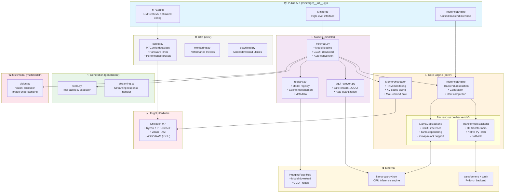

# Miniforge Architecture Overview

## Architecture Summary

| Layer | Purpose | Key Components |
|-------|---------|----------------|
| **Public API** | User-facing interface | `Miniforge`, `InferenceEngine`, `M7Config` |
| **Core** | Inference & memory management | Backends, memory manager, engine |
| **Models** | Model loading & conversion | Registry, GGUF conversion, MiniMax model |
| **Generation** | Output generation features | Tool calling, streaming |
| **Multimodal** | Vision capabilities | Vision processor |
| **Utils** | Configuration & helpers | M7Config, monitoring, downloads |
