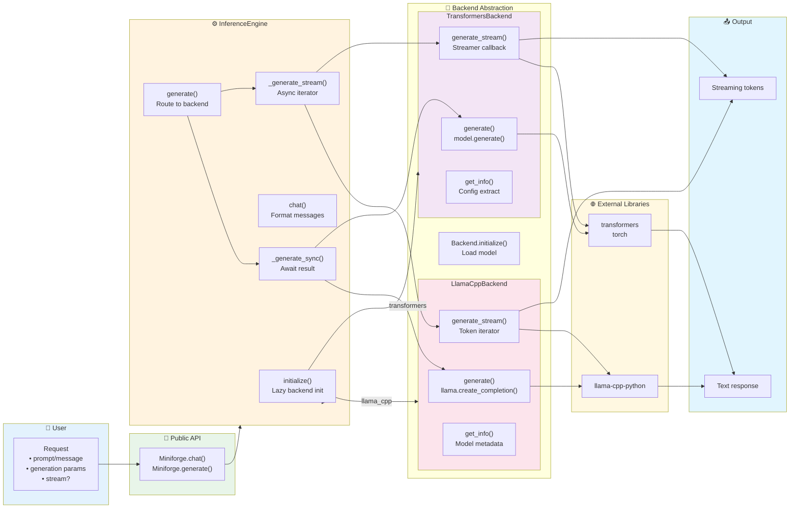
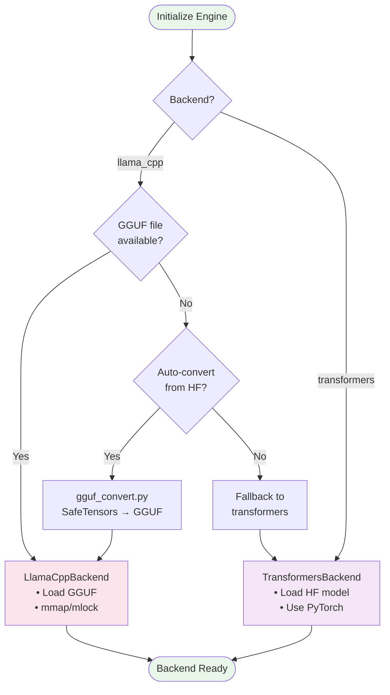

# Backend & Inference Flow

## Backend Selection Logic

## Key Design Decisions

1. **Lazy Initialization**: Backends loaded only when needed via `initialize()`
2. **Async-First**: All I/O operations are async to prevent blocking
3. **Backend Fallback**: llama.cpp preferred, transformers as fallback
4. **Streaming Support**: Unified streaming interface across backends
