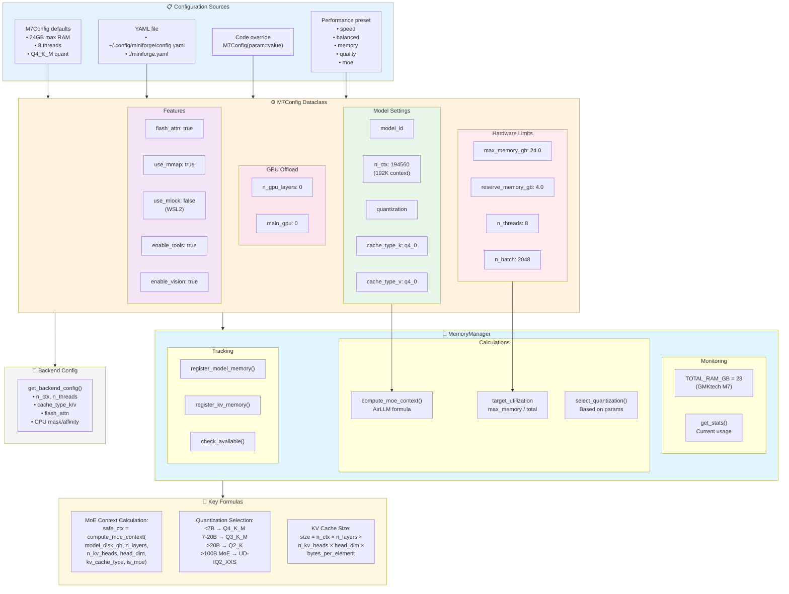

# Configuration & Memory Management



## Memory Calculation Details

### MoE Context Sizing (AirLLM-inspired)

```python
# For MoE models, dynamically compute safe context from available RAM
# instead of hardcoded values

safe_ctx = memory_manager.compute_moe_context(
    model_disk_gb=disk_size,      # GGUF file size
    n_layers=62,                   # From architecture map
    n_kv_heads=8,
    head_dim=128,
    kv_cache_type="q4_0",         # May fallback from turbo3
    is_moe=True
)
```

### Quantization Bit-Depth Map

| Quantization | Bits | Use Case |
|--------------|------|----------|
| UD-TQ1_0 | 1.0 | Extreme compression |
| UD-IQ2_XXS | 2.06 | Large MoE on 28GB |
| Q2_K | 2.5 | Balanced small models |
| Q3_K_M | 3.4 | Quality/space tradeoff |
| Q4_K_M | 4.5 | **Recommended default** |
| Q8_0 | 8.0 | Maximum quality |

### KV Cache Compression

| Type | Bits | Reduction vs F16 |
|------|------|------------------|
| f16 | 16 | 1x (baseline) |
| q8_0 | 8 | 2x |
| q4_0 | 4 | 4x |
| turbo3 | ~3 | ~5x (falls back to q8_0) |

## Configuration Loading Priority

1. Explicit path: `load_config("path.yaml")`
2. Platform config dir: `%APPDATA%/miniforge/config.yaml` (Windows)
3. Fallback: `~/.config/miniforge/config.yaml`
4. Local: `./miniforge.yaml`
5. Local: `./config.yaml`
6. **Default M7Config()**
