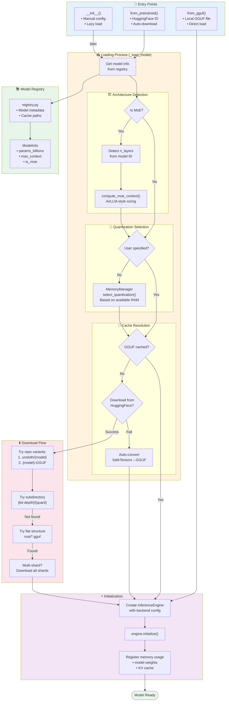

# Model Loading & Registry Flow



## Architecture Mapping

| Model Series | n_layers | Context | Notes |
|--------------|----------|---------|-------|
| MiniMax M2.x | 62 | 192K | Default for M2.7 |
| MiniMax-01 | 80 | 4M | Text/VL-01, M1 |
| Llama 4 | 48-80 | Varies | Scout/Maverick |
| Qwen3 | 24-80 | 128K | Size-dependent |
| Kimi K2.5 | 64 | 256K | 1M context capable |

## Cache Directory Structure

```
{cache_dir}/
├── gguf/
│   ├── MiniMaxAI/MiniMax-M2.7/
│   │   └── Q4_K_M/
│   │       └── model.gguf
│   └── unsloth/
│       └── ...
├── huggingface/
│   └── ...
└── registry.json
```
